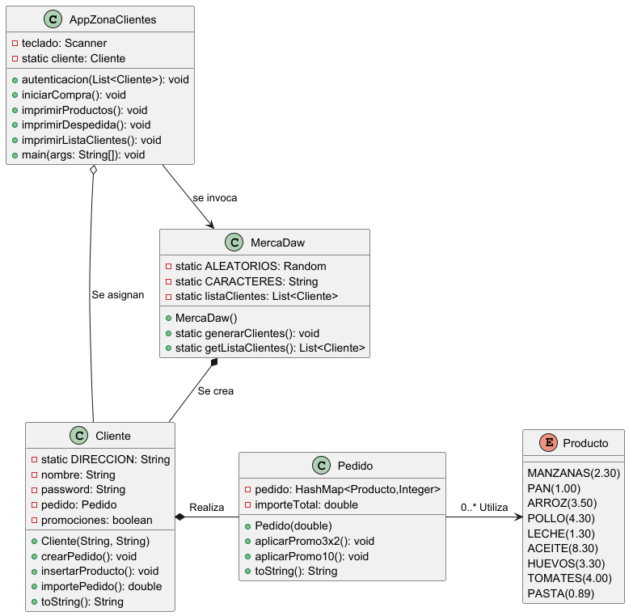

#  🛒  MercaDaw - sistema de Compra online

## 📄 Descripción del Proyecto
MercaDaw es una aplicación de gestión de productos, clientes y pedidos.  
Permite registrar clientes, autenticar usuarios, crear pedidos, aplicar promociones y realizar operaciones de compra online simuladas.

---

##  🚀  Ejecución del Programa y Pruebas de Uso

Vídeo Demo del funcionamiento del sistema MercaDaw en el siguiente enlace:

👉 [**Ver vídeo de ejecución y pruebas**](https://www.youtube.com/watch?v=)

El vídeo muestra:
- Inicio del programa.
- Autenticación de un cliente.
- Selección de productos.
- Aplicación de promociones.
- Ordenar productos por unidades
- Eliminación de productos.
- Visualización del resumen de compra.
- Finalización del pedido.

---

##  📂  Índice de Clases

- [AppZonaClientes](#appzonaclientes) — Clase principal que ejecuta el programa, controla la interacción del cliente (login, compra, promociones).
- [MercaDaw](#mercadaw) — Controla la generación y gestión de clientes.
- [Cliente](#cliente) — Representa a un cliente y gestiona su pedido.
- [Pedido](#pedido) — Representa un pedido con sus productos e importe total.
- [Producto](#producto) — Enumera los productos disponibles en la tienda.
- [OrdenarDescentente](#ordenardescentente) — Compara productos para ordenarlos por unidades vendidas.

---

## 🎯 Clases y Funcionalidades

---

### AppZonaClientes
Clase principal del programa, controla toda la zona de interacción con el cliente:
- Autenticación de usuario y contraseña.
- Iniciar una compra seleccionando productos del catálogo.
- Aplicar promociones 3x2 y descuentos del 10%.
- Ordenar productos comprados por unidades.
- Eliminar productos del carrito.
- Finalizar el pedido.

---

### MercaDaw
Clase de control general:
- Genera clientes aleatorios con usuario y contraseña única.
- Gestiona la lista de clientes registrados para pruebas de autenticación.

---

### Cliente
Representa un cliente registrado en la plataforma:
- Almacena usuario, contraseña, y su pedido actual.
- Permite crear pedidos, añadir productos, eliminar productos, aplicar promociones y mostrar el resumen de la compra.

---

### Pedido
Representa un carrito de compra:
- Asocia productos con la cantidad seleccionada.
- Calcula el importe total del pedido.
- Permite aplicar promociones como 3x2 y un descuento del 10%.

---

### Producto
**Enum** de productos disponibles:
- Cada producto tiene un precio fijo.
- Se utiliza para validar la selección del cliente durante la compra.

---

### OrdenarDescentente
Implementa un **Comparator** para ordenar productos:
- Ordena los productos por número de unidades de forma descendente.

---

## Documentación Técnica

La documentación completa del proyecto está disponible en el[`📚 JavaDoc`](https://fustran.github.io/Ejercicios_Ivan_Poo/com/poo/T7_Colecciones_Dinamicas_Datos/MercaDaw/package-summary.html).

> Incluye descripción detallada de cada clase y método del proyecto.

---

## 📈 Diagrama de Clases

Diagrama de clases **MercaDaw**:

---